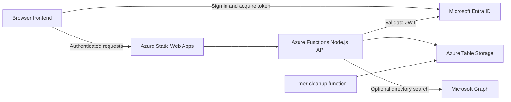

# Architecture

## System Overview

## Runtime Components

| Component | Location | Responsibility |
|---|---|---|
| Landing page | `index.html` | Main ZPlay UI and chat markup |
| Authentication and chat | `main.js` | MSAL setup, directory state, conversation loading, message sending |
| Presence | `presence.js` | Authenticated heartbeat polling and online-user updates |
| Styles | `styles.css` | Application presentation |
| API functions | `api/src/functions/` | HTTP endpoints and scheduled cleanup |
| Shared API libraries | `api/src/lib/` | Authentication, chat, directory, group access, and table helpers |
| Static Web Apps config | `staticwebapp.config.json` | Routing and security headers |
| CI/CD | `.github/workflows/` | GitHub Actions deployment |

## Main Request Flows

### Sign-in

1. The browser loads MSAL Browser.
2. The user signs in with Microsoft Entra ID.
3. The frontend requests the API delegated scope.
4. The access token is sent with API requests.
5. The API validates the token and uses its `oid` claim as the user ID.

### Presence

1. The browser sends an authenticated heartbeat approximately every ten seconds.
2. The API stores or updates the user in `OnlineUsers`.
3. The API returns users whose `LastSeen` value is within the active window.
4. Cleanup removes stale presence rows.

### Messaging

1. The user selects another directory or recent-conversation user.
2. The frontend requests the conversation.
3. The API verifies that the caller is authorized for the conversation.
4. A message is validated and stored in `Messages`.
5. The frontend renders the stored response and polls for updates.

### Directory Search

The API combines cached users with optional Microsoft Graph results. Group filtering is applied before users are returned to the client.

## Design Constraints

- Polling is used instead of a real-time messaging service.
- Azure Table Storage is optimized for low-cost small-scale storage.
- API endpoints use anonymous Azure Functions auth level but perform application-level JWT validation.
- Client-side identity is used for display only; authorization comes from the validated server token.
